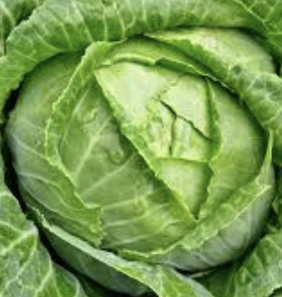

# Shopping-Cart-Restock

## Description: 
This code pulls grocery stock items from strapi and adds them to a cart. The cart shows the total price. Restock returns items from the cart.

## How to Run:
Start by downloading all files in the same folder on your machine. Load the index.html file in your browser. 

## Future Improvements:
I would like to update the styling of the cart.

## License Information:
This project is licensed under the MIT License.
